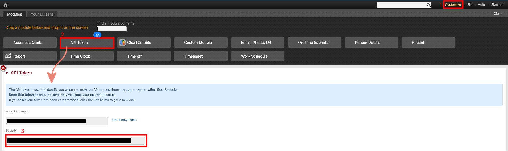
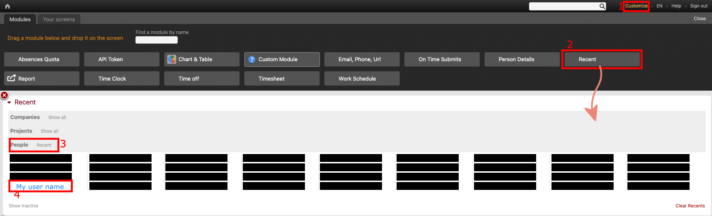

# Beebole Resumer

Retrieve the previous day's beebole entries and format them into a user-friendly string excluding weekends.

## Entry format

### {Project} | {Task} : {Comment}

## How to get the API token

1. Click on customize

2. Drag and drop the module _API Token_ into the work zone

3. Copy the value on the `base64` field and use it as the `BASE64_AUTH_TOKEN` environment variable.

## How to get the user id

1. Click on customize

2. Drag and drop the module _Recent_ into the work zone

3. Click on the People dropdown

4. Click on the user to go to it's profile

5. The profile url should be `https://beebole-apps.com/#person-{ID}`. Use the number in the place of `{ID}` as the `USER_ID` environment variable.

## Discord webhook

It is possible to send a message to a discord channel using the webhook url. More information about discord's webhooks [here](https://support.discord.com/hc/en-us/articles/228383668-Intro-to-Webhooks) or [here](https://discord.com/developers/docs/resources/webhook).

Once you have this information, you can set the `DISCORD_WEBHOOK_URL` environment variable. `DISCORD_WEBHOOK_NAME` is optional and it is _Beebole Resumer_ by default.
